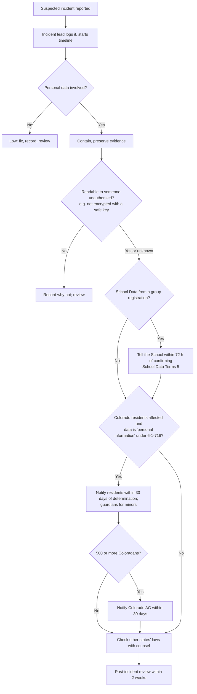

# Incident response plan

Status: draft for owner approval, 2 Oct 2026. Owner: David Shaw (to confirm).

**This is not legal advice.** It is an operating plan written without counsel. Breach-notice law differs by state and changes often. Have counsel review this plan, and call counsel early in any real incident involving personal data.

## 1. What counts as an incident

Any event that may have exposed, altered, lost or made unavailable personal data Stellr holds, or the systems that hold it. Examples:

- A signing, download, pay or join link reaching the wrong person or a third party.
- An admin account, console account or secret (`ESIGN_TOKEN_SECRET`, `ESIGN_BACKUP_KEY`, the Supabase service-role key, the Google service account key, `CRON_SECRET`) exposed or misused.
- The integrity check reporting a hash mismatch or broken audit chain (`lib/esign/integrity.ts`).
- A vendor telling us of a breach on their side (Supabase, Clerk, Resend, Google, DocuSign, Checkr, Stripe, HubSpot, Vercel).
- Loss of the database or file storage. Supabase Free has no backups; recovery is from the encrypted drive copy.
- An email or roster spreadsheet with student data sent to the wrong address.

## 2. Roles and contacts

| Role | Name | Contact |
|---|---|---|
| Incident lead (decides, notifies) | David Shaw (to confirm) | (to confirm) |
| Deputy | (to confirm) | (to confirm) |
| Counsel | (to confirm) | (to confirm) |
| Insurer (cyber or general liability) | (to confirm) | (to confirm) |
| Privacy inbox | privacy@stellreducation.org | — |
| Vendor security contacts | Supabase, Vercel, Clerk, Resend, Google Workspace, DocuSign, Checkr, Stripe, HubSpot | (to confirm; record each vendor's security or support route) |
| Colorado Attorney General | (to confirm current breach-notice submission route) | — |
| Utah Attorney General / Utah Cyber Center | (to confirm with counsel) | — |

## 3. Detection

Sources to watch:

- Admin alerts from `lib/notify.ts`: integrity failure, heartbeat (`lib/esign/heartbeat.ts`), storage warning on the engine card (`lib/esign/state.ts`).
- `cron_runs` rows with errors.
- Reports to privacy@ or hello@, including "URGENT: Minor Data" (Privacy §15).
- Vendor notices.
- Unusual entries in `esign_access_log` (for example, downloads of restricted records, or many downloads by one admin).

Anyone who suspects an incident tells the incident lead the same day. Do not investigate alone in production and do not delete anything.

## 4. Triage (first 24 hours)

Record a timeline from the first report. For each question, write what you know and how you know it.

1. What data? Which tables, files or systems? Check against the retention schedule.
2. Whose data? How many people, how many minors, how many under 13, which states?
3. Was it encrypted with a key that was not also exposed? (The drive copy is AES-256-GCM; if `ESIGN_BACKUP_KEY` is safe, a leak of drive files alone is not a leak of readable data.)
4. Is it still happening?
5. Does it include data that triggers a state breach law? For Colorado (C.R.S. 6-1-716), "personal information" includes a name together with, among others, medical information, a student identification number, or an online account username or email with its password. Participant rows hold health conditions, so a leak of `participants` or `members` is likely notifiable (to confirm with counsel).
6. Is it School Data under the School Data Terms (data a school shared for a group registration)?

Severity:

| Level | Meaning | Example |
|---|---|---|
| High | Readable personal data of minors, health data, or signed records left our control | Service-role key leaked; roster with medical notes emailed to a stranger |
| Medium | Limited exposure, or exposure we can show was not accessed | One signing link forwarded, opened by no one else (check audit trail) |
| Low | No personal data exposed; availability only | A cron stopped for a day |

## 5. Containment

Pick what fits. Record each step and the time.

- **Signing links:** void the agreement and reissue (bumps `token_version`, killing the link). For a wide leak, rotate `ESIGN_TOKEN_SECRET`: every link and session dies; reissue outstanding agreements.
- **Native engine:** set `esign_provider_state.mode = 'docusign_only'` to stop new native agreements.
- **Admin account:** remove the Clerk `admin` role and `staff_roles` scope; revoke sessions in Clerk.
- **Keys:** rotate the Supabase service-role key, Google service account key, `CRON_SECRET`, Resend, Stripe, DocuSign, Checkr and HubSpot keys as relevant. If `ESIGN_BACKUP_KEY` is exposed, rotate it, keep the old key escrowed for old copies, and re-encrypt (to confirm a re-encryption procedure; the code reads one key).
- **Email misdirection:** ask the recipient to delete it and confirm in writing.
- **Data loss:** restore from the drive with `scripts/esign-restore-drill.ts --restore <id>` and the latest `export-*.json.enc`. Expect up to 24 hours of loss.

## 6. Evidence preservation

Preserve before you fix, where safe.

- `esign_audit_events` is append-only and hash-chained; the database refuses edits and deletes (trigger `esign_audit_events_guard`). Verify chains with `esign_verify_audit(envelope)`. Compare with the daily anchor in the encrypted export.
- **Pause the retention purge** if the incident touches signed records that may be near their `retain_until` date, so evidence is not deleted mid-investigation (to confirm the method: skip the `retention` step in `runEsignMaintenance`).
- Export `esign_access_log`, `cron_runs`, `member_activity_log` and relevant rows to a dated, encrypted file.
- **Vercel runtime logs last about an hour on Hobby.** Capture them at once.
- Export Clerk sign-in logs, Supabase logs, Google Workspace audit logs and Resend send logs while they still exist.
- Keep a single written timeline with times, sources and decisions.

## 7. Notification

Decide with counsel. The commitments below are the ones Stellr has made in writing or that the plan names.

| Who | When | Source |
|---|---|---|
| Affected Colorado residents | Without unreasonable delay, and **no later than 30 days** after determining a breach occurred | C.R.S. 6-1-716; Privacy §11 |
| Colorado Attorney General | Within the same 30 days, when **500 or more** Colorado residents are affected | C.R.S. 6-1-716 |
| Consumer reporting agencies | When 1,000 or more Colorado residents are notified (to confirm with counsel) | C.R.S. 6-1-716 |
| The School | **Within 72 hours** of confirming unauthorised access to or disclosure of School Data | School Data Terms §5 |
| Parents or guardians | For any minor's data: notify the parent or guardian, not the child | Privacy §2, §12 |
| Residents of other states | Each state's own law (Utah, where Stellr is incorporated: Utah Code 13-44-202, including notice to the Utah AG and Utah Cyber Center at 500+ Utah residents — to confirm with counsel) | State law |
| Vendors | When the incident started in or affects their system | Contracts |
| Insurer | As the policy requires (to confirm) | Policy |

School Data Terms §5, exact wording:

> "If Stellr learns that School Data has been accessed or disclosed without authorisation, it will tell the School within 72 hours of confirming it, say what happened and what is being done, and cooperate with the School in notifying families where the law requires."

Notices say, in plain words: what happened, when, what data, what we have done, what the reader can do, and who to contact. Colorado notices have required content (to confirm with counsel). Send notices by email to the address on file; for minors, to the guardian address. Keep copies.

## 8. Decision tree

## 9. Post-incident review

Within two weeks of closing:

- What happened, root cause, timeline, who was affected.
- Which controls worked and which did not.
- Changes to make, each with an owner and date. Update the WISP, the retention schedule and the sub-processor register if they change.
- Keep the review, the timeline and copies of notices for at least 7 years (to confirm).

## 10. Testing this plan

Walk through one scenario a year (for example, "a guardian's signing link was forwarded to a class group chat") with whoever holds admin access. Record the date and the gaps found.
