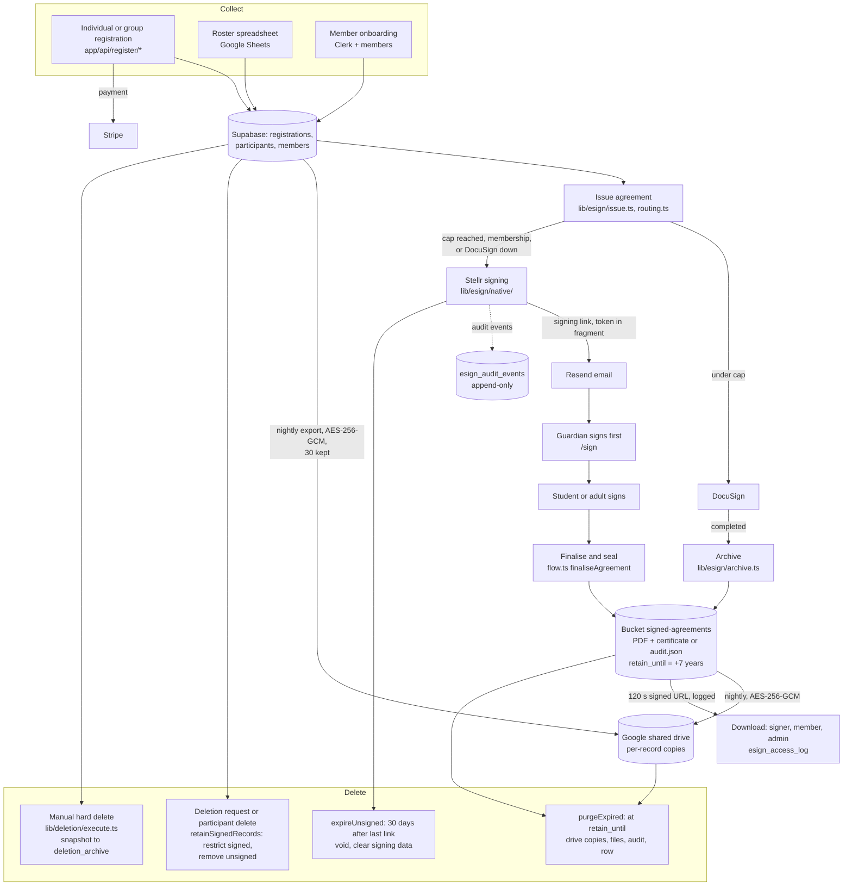

# Sub-processor register and data map

Status: draft for owner approval, 2 Oct 2026. Owner: David Shaw (to confirm).

This register must match the provider table in the Privacy Policy §7.1 (`app/(public)/privacy/page.tsx`). School Data Terms §3 promises that a provider is added to that list **before** it receives School Data. Change the policy first, then this file.

DPA status: "Standard" means the provider's own data processing addendum governs our use (Privacy §7.1 allows this). Only Apollo.io and DocuSign are named in the policy as being on standard terms; every other status is **(to confirm)**. Location: only Supabase is stated in the policy ("United States"); others are **(to confirm)**.

## 1. Register

| Provider | Purpose | Personal data categories | Minors' data? | Location | DPA status | Code |
|---|---|---|---|---|---|---|
| Supabase | Database, file storage (signed agreements, templates), hosting | All account, registration and participant data incl. health and dietary; signed agreements and signing records | Yes | United States (Privacy §11) | (to confirm) | `lib/supabase.ts`, `supabase/migrations/` |
| Vercel | Hosting, crons, Vercel Analytics, Blob storage | Usage and technical data incl. signers' IP and browser in transit; media files | Yes (in transit) | (to confirm) | (to confirm) | `vercel.json`, `next.config.mjs`, `@vercel/analytics`, `@vercel/blob` |
| Clerk | Authentication, admin roles | Name, email, login credentials, session data | Yes | (to confirm) | (to confirm) | `@clerk/nextjs`, `lib/admin-auth.ts` |
| Resend | Transactional email, incl. signing and download links | Name, email, email content incl. private links; bounce events | Yes | (to confirm) | (to confirm) | `lib/email.ts`, `app/api/webhooks/resend/route.ts` |
| Stripe | Payments, refunds | Name, billing address, card data (held by Stripe) | Payer is usually an adult (to confirm) | (to confirm) | (to confirm) | `lib/stripe.ts` |
| DocuSign | E-signature until about 6 Aug 2027 | Signer names and emails; pre-filled form details (participant name, DOB, event); signed forms | Yes | (to confirm) | Standard (Privacy §7.1) | `lib/docusign.ts`, `lib/esign/providers/` |
| Google Workspace | Staff email and documents; school roster Sheets; Calendar; encrypted backup of signed agreements | Roster details (names, DOB, health, emergency contacts); backups are ciphertext Google cannot read | Yes | (to confirm) | (to confirm) | `lib/google-sheets.ts`, `lib/google-calendar.ts`, `lib/esign/backup-store.ts` |
| Checkr | Background checks for adult mentors and volunteers | Name, email, work location; what the candidate gives Checkr directly | No (adults only) | United States (to confirm) | (to confirm) | `lib/background-provider/checkr.ts` |
| Printful | Store orders | Name, delivery address | Possibly (to confirm) | (to confirm) | (to confirm) | `lib/store/` (`api.printful.com`) |
| Discord | Community chat, opt-in | Discord username and posts | Possibly | (to confirm) | (to confirm) | No integration in code |
| Timestamp authority (DigiCert by default) | Trusted timestamp on sealed PDFs, from mid-October 2026 | A hash only; no personal data | No | (to confirm) | Not needed (no personal data) | `lib/esign/native/seal.ts` |
| Sanity | Content management | None | No | (to confirm) | Not needed | `lib/sanity.ts` |
| HubSpot | Lead capture, enquiries | Name, email, enquiry; `hubspotutk` cookie | Possibly (e.g. scholarship enquiries) (to confirm) | (to confirm) | (to confirm) | `lib/hubspot.ts` |
| Google Analytics, Tag Manager, Ads | Aggregate analytics; ad measurement with consent | Usage data, cookie identifiers; not on private routes | Possibly (cookie ids only) | (to confirm) | (to confirm) | `app/layout.tsx` |
| Meta, LinkedIn (via GTM) | Ad measurement with consent | Cookie identifiers, pages visited | Possibly (cookie ids only) | (to confirm) | (to confirm) | GTM container |
| Apollo.io | Organisation lookup on educator and partner pages, with consent | IP, cookie identifiers, pages | No (not on student pages) | (to confirm) | Standard, apollo.io/dpa (Privacy §7.1) | `lib/apollo-*.ts` |

### Not in Privacy §7.1 — decide whether to add

| Provider | What it touches | Recommendation |
|---|---|---|
| Motion | Booking pages for calls; Stellr reads the resulting Google Calendar events (`lib/motion-bookings.ts`) | Add if people enter personal data on Motion pages (to confirm) |
| GitHub | Source code and CI; no production data | Not a sub-processor if no personal data is ever committed |
| Anthropic, OpenAI, Perplexity | AEO prompt panel (`scripts/aeo-prompt-panel.ts`): public prompts only | Not a sub-processor; keep personal data out |
| IndexNow | Public URLs only | Not a sub-processor |
| Twilio | SMS is deferred; no calls made (`lib/sms.ts`) | Add before SMS goes live |

## 2. Data map: registration to deletion

Notes on the map:

- The daily job is `runEsignMaintenance` (`lib/esign/maintenance.ts`), run from the `docusign-form-data` cron at 09:15 UTC (`vercel.json`): usage, finalise, reconcile, outbox, archive, replicate, export, integrity, retention, heartbeat. A `seal` step (certificate seal with trusted timestamp) runs after `archive` and before `replicate` (`lib/esign/native/certificate-seal.ts`).
- `deletion_archive` and roster spreadsheets have no deletion path in code. See README, Conflicts found.
- DocuSign keeps its own copy of what it signed; `purgeExpired` does not reach it.
